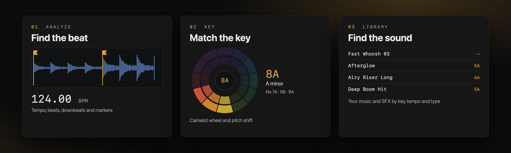
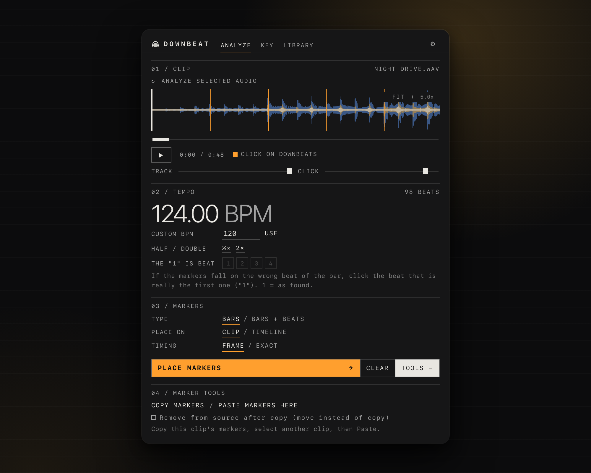
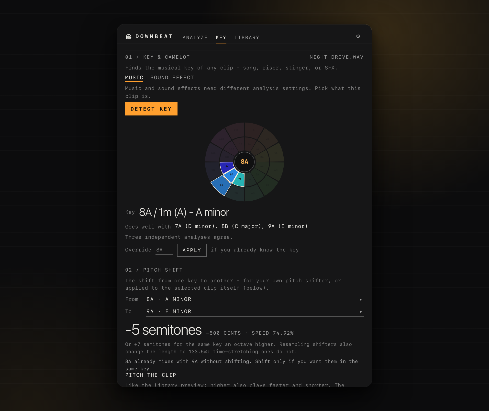
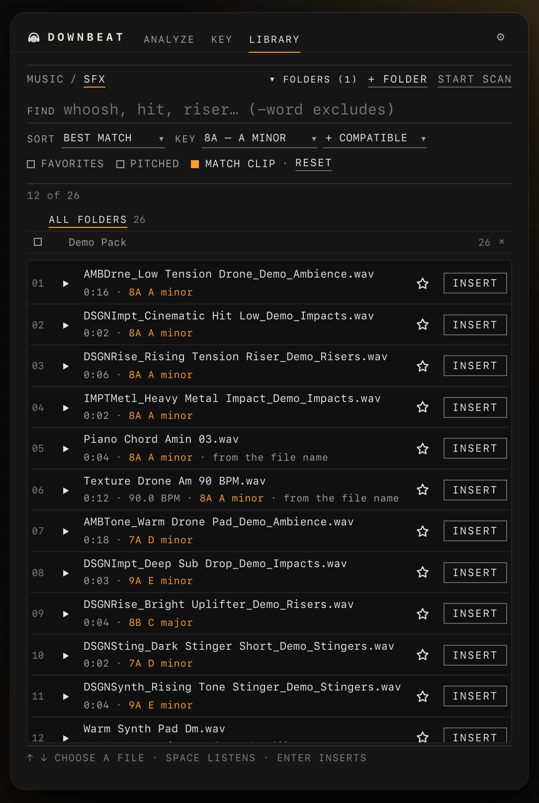
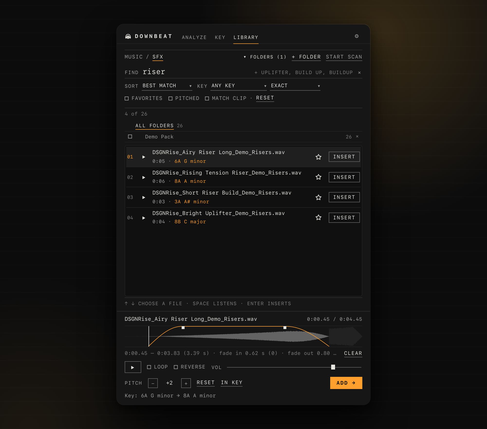

<p align="center">
  
</p>

<h1 align="center">Downbeat</h1>

<p align="center">
  All you need to speed up the sound design of your videos, in one plugin.<br>
  Beat markers, musical key and a smart library of your own music and sound effects,
  inside Premiere Pro and After Effects. Free and offline.
</p>

<p align="center">
  
  
  
  
  
  
</p>

<p align="center">
  <a href="https://github.com/ominousopera/Downbeat/releases/latest"></a>
  &nbsp;
  <a href="https://github.com/ominousopera/Downbeat/releases/latest"></a>
</p>

<p align="center">
  
</p>

> [!NOTE]
> **Downbeat works best in Premiere Pro.** It is built around Premiere Pro,
> where every feature is available. After Effects 2021 and up is supported
> with a smaller set:
>
> - Markers go on whole video frames only: no sample-accurate **Exact** timing
>   and no **Shift**.
> - The layer must play at normal speed (Stretch 100%, no Time Remap),
>   otherwise no markers are placed.
> - You cut at the markers by hand with **J / K** and **Split Layer**; there is
>   no Razor tool snapping to them.
> - A marker keeps only its short label.
> - Library sounds are added as a new layer; fades become volume keyframes,
>   and pitch and reverse are set through Time Stretch.

> [!IMPORTANT]
> **The analysis is automatic, so check it by ear.** Downbeat estimates the
> tempo, beats, bars and key from the audio, and it can be wrong, especially
> on tracks with a changing tempo, a weak or unusual beat, a long quiet intro,
> a time signature other than 4/4 (Downbeat assumes four beats to a bar;
> **Bars + beats** is the safer choice there), or very short sounds. Press play on the click track and listen. If something
> is off, fix it: half / double tempo, the beat that is the "1", **Shift**, or
> set the key by hand (**Override**). The key of a sound effect is only a hint,
> because many effects have no clear pitch. **Match clip** and **In key** give
> you a shortlist to audition, not a promise that two sounds will blend.

## Why editors use it

**Working with music in a video edit is three jobs:** getting the timing
right, getting the harmony right, and finding the right sound. Downbeat does
all three in one plugin inside Premiere Pro and After Effects, for every kind
of edit: vlogs, reels and shorts, music videos, weddings and events, trailers,
ads, documentaries, game montages.

| 01 · TIMING | 02 · HARMONY | 03 · SOUND |
|---|---|---|
| **Find the beat**<br>Tempo, beats and the strong beat of every bar, placed as markers. Clips snap to them, so cutting many video clips to one track is fast and lands on the downbeat once the detection is right. | **Match the key**<br>The musical key of every track (Camelot and note names) and the keys that blend with it. Make transitions between songs that fit, or pitch one into the key of the other, so they clash less. | **Find the sound**<br>Your own music and sound effects, searchable by **key, tempo and sound type** without leaving the app. Pick the clip you are cutting, press Match clip, and see what fits. |

**One workflow:** analyze the track, check its key, find music and effects
that fit, drop them on the timeline.

**Not only on the beat.** Cutting on the beat is half of it. For a series of cuts
and sounds to play as one track, their notes have to fit as well: a hit or a
riser in the wrong key breaks the montage into separate pieces, in the right
key it sounds like one piece. Downbeat shows the key of every clip and sound,
so you can pick the ones that match, or pitch one into the key of the other.

### Without Downbeat and with it

| | Without Downbeat | With Downbeat |
|---|---|---|
| **Finding the tempo** | Tap along, count by ear | Analyze gives the BPM, beats and downbeats in seconds |
| **Cutting on the beat** | Nudge every cut by eye and ear, frame by frame | Markers on every bar or beat; clips snap to them |
| **Knowing a track's key** | Guess by ear or open a separate app | Detect key shows it in Camelot and note names, with the keys that fit |
| **Moving between two songs** | Trial and error; a clash shows up late | Pick keys that blend, or pitch one clip into the key of the other |
| **Finding a sound** | Search by file name, scroll folders, audition one by one | Search by key, tempo and category (type "swoosh", find your whooshes); **Match clip** shows only what fits |
| **A riser or hit in the right key** | Pitch it in another tool, export, import again | Preview with pitch, reverse and fades, then insert |
| **Getting it on the timeline** | Leave the app and drag files around | One click at the playhead, as your original file |
| **Where it happens** | Several apps and windows | One plugin in Premiere Pro and After Effects |

Free, offline and private: nothing is uploaded, and your original files are
never changed.

## What it does

<table>
<tr>
<td width="38%" valign="top">



</td>
<td valign="top">

### Analyze

Finds the tempo, beats and downbeats with two detectors (a classic algorithm
and the Beat This! model, which runs locally) and puts markers
where it hears them, so you can cut there; check them with the click track. Then Premiere does the rest: with snapping on
(<kbd>S</kbd>), the Razor tool (<kbd>C</kbd>) snaps to the markers, so cutting
to the beat takes minutes.

- **Bars or Bars + beats.** One marker on the "1" of every bar for a calm,
  strong-beat edit, or on every beat, with each downbeat kept apart, for a fast
  one. Switch any time; placing again replaces the old markers and never
  touches yours.
- **On the clip or on the timeline.** Clip markers travel with the clip when
  you move or trim it; timeline markers stay in the sequence.
- **Frame-accurate by default.** Each marker sits at the start of the video
  frame the beat begins in, so a cut lands on the beat or up to one frame
  before it, never after.
- **Sample-accurate marker timing in Premiere Pro.** Choose **Timing → Exact** and turn on
  **Show Audio Time Units** in the Timeline panel menu: the ruler then counts
  audio samples and you can cut between frames, right on the beat.
  **Shift − / +** nudges a whole track 1 ms at a time.
- Half / double tempo fix, pick which beat is the "1", or type your own BPM;
  a click track lets you check it by ear.
- **Refined / Basic.** If the markers miss the beats, switch between the two
  detectors' results with one click.
- **Copy and paste markers** from one clip to another, or move them.

</td>
</tr>
</table>

<table>
<tr>
<td valign="top">

### Key

Musical key in Camelot and note names from three opinions (sound effects get
a key only when they have a clear pitch). A pitch shift
calculator, and "Pitch the clip" retimes the clip itself to another key. Your
audio is never rewritten.

</td>
<td width="38%" valign="top">



</td>
</tr>
</table>

### Library

Your own music and sound effects, with the key of every file written right
next to it. Pick the song you are cutting, press **Match clip**, and the list
shrinks to the sounds that fit it.

<table>
<tr>
<td width="50%" valign="top">



</td>
<td width="50%" valign="top">



</td>
</tr>
</table>

- **Key and tempo on every file**, like `8A · A minor` or `124 BPM`, found
  when you scan your folders.
- **Names that already say the key.** Many sample packs put it in the file name
  (`Pad Am`, `Bass Fm 128 BPM`, `Key Emaj`, `8A`). Downbeat reads it, trusts it
  over its own guess, and marks the row *from the file name*, so you know which
  keys come straight from the pack. Those files are ready instantly, with no
  analysis.
- **Not every sound effect has a key.** Whooshes, impacts, footsteps, wind
  or rain are noise, not notes: they show "no clear pitch" and a key search
  skips them. Only tonal sounds (risers, drones, stingers, pads, bass hits)
  get a key, and even then it is a hint to check by ear.
- **Match clip** shows only the sounds in the same or a neighbouring key (and
  the same tempo for music), so you stop auditioning files that clash.
- **Search by sound type.** Type "swoosh" and it finds your whooshes, because
  it knows the sound-effect categories and their synonyms.
- **Filters and shortcuts.** Filter by key (exact or compatible) and by BPM
  (a range, also half and double tempo), show only favorites (★) or only
  pitched sounds, sort by match, name, length or tempo. ↑ ↓, Space and Enter
  work without the mouse.
- **Folders you can scope.** Tick folders to search only those. Files that are
  not there any more are marked, not forgotten, and **Settings → Library →
  Save a copy / Load a copy** backs the whole library up.
- **Preview in the panel** with play, loop, reverse and volume. Drag across the
  waveform to pick just a part of the sound, and drag the fade handles to add
  a fade in and a fade out.
- **Pitch it up or down** by up to 12 semitones, like a sampler (higher is also
  faster and shorter). The panel tells you the new key:
  `6A G minor → 8A A minor`. Or press **In key** and every sound you listen to
  is already pitched into your song's key.
- **Add at the playhead** as your original file. The trim, fades, pitch and
  reverse are set on the clip, and no processed copy of your audio is ever
  written.

## FAQ

### Why it matters

<details>
<summary><b>Why cut on the beat, and why match the key?</b></summary>

You feel a cut that is off the beat even if you can't say why. Land it on the
beat and the clip just feels right. Miss by a few frames and it looks like a
mistake.

It also helps everything built on the cut: text hits, transitions and speed
ramps all sit on the same beat. With markers you don't tap along and nudge
every cut by eye.

The beat is only half of a good cut. When you assemble cuts and sounds into one
track, the notes have to fit too: pieces in different keys sound like separate
clips, pieces in the same or a neighbouring key sound like one track. Downbeat
marks the beat to cut on and shows the key to match, so you pick both.
</details>

<details>
<summary><b>How do DJs mix tracks, and what can an editor take from that?</b></summary>

A DJ lines up the tempo of two tracks and brings the new one in on the first
beat of a bar, usually where a phrase starts (every 4, 8 or 16 bars). They also
pick songs in the same or a neighbouring key, so the two don't fight each
other.

Do the same when you crossfade music in an edit: start the next track on a bar
marker, check that the tempos are close, and pick a key that fits. Downbeat
shows you the tempo, the bar markers and the key.
</details>

<details>
<summary><b>Why use sound effects that are in key?</b></summary>

A lot of effects have a pitch: risers, booms, stingers, drones. If the pitch
doesn't fit the music, you hear that something is off, even if you can't tell
what. In key, the effect sits inside the track instead of on top of it.

The Library shows the key of every effect, can show only the ones that fit your
song, and can pitch an effect into its key. Effects with no pitch, like clicks,
are left out of this.
</details>

<details>
<summary><b>Why do I need a plugin for this?</b></summary>

Tempo, bars, key, finding the right sound: most editors do it by ear, by
tapping along, or in separate apps, and it eats time.

Downbeat does it in one plugin, so the time goes into the edit. And you don't
need any music theory.
</details>

### Using Downbeat

<details>
<summary><b>How does the analysis work?</b></summary>

Everything runs on your computer; nothing is sent anywhere.

**Tempo, beats and bars.** Two detectors listen to the same audio. The first
is a classic beat tracker from the open-source
[essentia](https://essentia.upf.edu/) library, which finds the tempo and the
beats. The second is **Beat This!**, a small neural network that finds beats and
downbeats (the first beat of each bar). Downbeat uses the network's result only
if it passes checks against the first one (for example, it must not hear the
track at half or double speed); otherwise the classic result stays. With the
classic detector the first beat of a bar is chosen by weighing the low-end
energy and the chord changes at each beat; with the network it comes from the
network itself. The beat times are then evened out along the local tempo line,
corrected for the detectors' delay, and every marker is placed at the start of
the video frame its beat falls in (or at the exact time, in Premiere Pro with
**Timing → Exact**).

**Key.** Three independent analyses vote: classic key profiles (essentia), the
chord progression, and **S-KEY**, a small neural network trained on music. The
profile vote stands unless the chord analysis and S-KEY agree with each other on
a different key; then theirs wins. Sound effects use another setup (a longer
analysis window and no S-KEY, which is trained on music).

**Library scan.** To stay fast the scan reads part of each file. It finds the
key and, for music, the tempo, and it decides whether a sound effect has a clear
pitch at all. A key or tempo written in the file name is used as it is.

The result is an estimate, not a measurement: see "check it by ear" above. The
components and their licenses are listed in [`NOTICE.md`](NOTICE.md).
</details>

<details>
<summary><b>Does it work offline? Is anything uploaded?</b></summary>

It works completely offline. Nothing is uploaded, there is no account, no
analytics and no update check; the panel never goes online. The only web link
is the feedback link in Settings, which opens in your browser after a
confirmation.
</details>

<details>
<summary><b>Does it change my audio files?</b></summary>

No. Your files are never modified, and no processed copy of them is written.
Sounds go on the timeline as your original file, with the trim, fades, pitch
and reverse set on the clip itself. The only files Downbeat writes are its own
settings, the track library and short-lived temporary files, in
<code>Documents/Downbeat</code>; <b>Settings → Delete my data</b> removes them.
</details>

<details>
<summary><b>What is the Camelot wheel?</b></summary>

A DJ notation for the 24 musical keys: numbers 1 to 12 around a wheel, and a
letter, <b>A</b> for minor and <b>B</b> for major, so <code>8A</code> is A minor
and <code>8B</code> is C major. Keys next to each other on the wheel (one
number up or down with the same letter, or the same number with the other
letter) blend well. Downbeat shows the Camelot code next to the note name and
lists the keys that go well with the one it found.
</details>

<details>
<summary><b>Which sounds can I put in the Library?</b></summary>

Any folder with audio files (WAV, AIFF, MP3, M4A, AAC, FLAC, OGG), added as
<b>Music</b> or <b>SFX</b>. A scan reads the key and, for music, the tempo.
Sound effects get no tempo; most of them have no pitch either, so they show
"no clear pitch" and are skipped by a key search. Files your host cannot import
(for example FLAC and OGG in Premiere Pro) can be scanned and previewed, but
not inserted.
</details>

<details>
<summary><b>Does it work with any time signature?</b></summary>

Downbeat assumes four beats to a bar and has no time-signature detection. On a
track that is not in 4/4 the downbeat pick can look confident and still be
wrong; **Bars + beats** is the safer choice there.
</details>

<details>
<summary><b>Do I need to cut by hand after Analyze?</b></summary>

Downbeat places the markers; you do the cutting. In Premiere Pro, with snapping
on, the Razor tool snaps to the markers, so it takes a few clicks per cut.
</details>

<details>
<summary><b>Which versions are supported?</b></summary>

Premiere Pro 2021 and newer and After Effects 2021 and newer, on macOS (Apple
Silicon and Intel) and Windows x64, with an interface in English, Russian and
Spanish. Analyze reads what the host can put on a
timeline and the panel can decode: WAV, AIFF, MP3, M4A / AAC, and the audio of
MP4 / MOV.
</details>

## Install

1. Download the package for your computer from
   [Releases](https://github.com/ominousopera/Downbeat/releases/latest):
   `Downbeat-1.0.0-mac.zxp` or `Downbeat-1.0.0-win.zxp`.
2. Drag it onto [ZXP Installer](https://aescripts.com/zxpinstaller/) (free),
   restart Premiere Pro or After Effects, then open
   `Window > Extensions > Downbeat`.

Signed with a self-signed certificate: no Terminal commands and no
`PlayerDebugMode`. Each package carries only its own platform's Node.js; the
wrong one says so when you press Analyze.

<details>
<summary><b>Build from source</b></summary>

```sh
git clone https://github.com/ominousopera/Downbeat.git
cd Downbeat
scripts/fetch-node-runtime.sh        # Node.js for macOS and Windows, SHA-256 checked
scripts/fetch-beatthis-runtime.sh    # onnxruntime-web by its committed lockfile
scripts/build-zxp.sh                 # needs Adobe's ZXPSignCmd, see below
```

Details, the checks that run before a build and the code layout are in the
developer sections further down this page.
</details>

<details>
<summary><b>Privacy and security</b></summary>

Everything runs on your computer. The panel makes no network calls, and
`scripts/check-code.js` fails the build if code that could is added. Saved data
(settings, track library, temporary files) lives in `Documents/Downbeat`,
never inside the plugin's own folder. Report a vulnerability privately through
the repository's Security tab; see [`SECURITY.md`](SECURITY.md).
</details>

## License

AGPL-3.0, see [`LICENSE`](LICENSE). Third-party components:
[`NOTICE.md`](NOTICE.md). Guide: [English](GUIDE.md) ·
[Russian](GUIDE.ru.md) · [Spanish](GUIDE.es.md). Contributing:
[`CONTRIBUTING.md`](CONTRIBUTING.md).

Built with the help of Claude Code.

---

## For developers

## Dev install (symlink) — the only case that needs PlayerDebugMode

For iterating on code, where every save should show up on the next panel
reload without a rebuild:

```sh
scripts/dev-install.sh
```

It symlinks this folder into Premiere's extensions folder and sets
`PlayerDebugMode=1` for CSXS 9-12 (idempotent). A source folder has no
signature, and `PlayerDebugMode` is what lets CEP load an unsigned one. It
does that for every unsigned extension on the machine, so don't leave it
on for a shared computer. `scripts/dev-uninstall.sh` removes the symlink
only, never a real directory.

**Don't have both at once.** A ZXP installer's Remove only removes the
copy it installed; a symlink keeps loading regardless. `build-zxp.sh`
refuses to run while the dev symlink exists.

Attach Chrome DevTools: create a file named `.debug` in the extension
folder (see Adobe's CEP documentation for the format; it is a
developer-local file and is not in the repository), and with the panel
open go to `http://localhost:<port>`.

## Build a release

```sh
scripts/dev-uninstall.sh   # only if the dev symlink is currently active
scripts/build-zxp.sh
```

Bump `ExtensionBundleVersion` in `CSXS/manifest.xml` first. The script refuses
to overwrite an existing version, because some installers silently skip a
reinstall with an unchanged version string. Output goes to `zxp-build/` next
to the repository (the script creates it): `Downbeat-<version>-mac.zxp` and
`Downbeat-<version>-win.zxp`, each with only its own platform's Node.js.

The build scripts are `sh` and run on macOS; the Windows package is built
there too (it only swaps in the Windows Node.js). The checks use `git ls-files`,
so work in a git clone, not an unzipped archive.

From a fresh clone, once:

```sh
scripts/fetch-node-runtime.sh       # Node.js 24.18.0 for macOS (arm64, x64) and Windows x64, SHA-256 checked
scripts/fetch-beatthis-runtime.sh   # onnxruntime-web 1.27.0 by its committed lockfile (models/ is in the repository)
```

Signing needs Adobe's `ZXPSignCmd` (Adobe's CEP resources, or the
`vite-cep-plugin` npm package): put its path in `scripts/build.local.sh`
as `ZXPSIGNCMD="..."` (not in git), or in the `ZXPSIGNCMD` environment
variable, or on the PATH. The first build makes a self-signed certificate
in `zxp-build/` with a random password kept next to it.

Before packaging, the script refuses to build if any of these fail
(a pre-build gate):

- manifest is not well-formed XML;
- `index.html` points at a missing file;
- a script looks up an element id that does not exist
  (`scripts/check-dom-ids.py`);
- any panel script, worker or ExtendScript file does not parse;
- the panel does not finish booting, or Delete my data touches anything
  that is not its own, or booting writes into the extension folder
  (`scripts/test-panel-boot.js`);
- the delete code can be tricked into touching anything outside its own
  files (`scripts/test-delete-safety.js`);
- the host scripts misbehave on mock hosts (`scripts/host-mocks.js`):
  After Effects functions, Library insert, and placing / clearing markers
  touching anything but Downbeat's own (`test-host-ae.js`,
  `test-host-insert.js`, `test-marker-replace.js`);
- the pitch calculator and Beat This!'s doubled-beat merge drift
  (`test-pitch.js`, `test-beat-merge.js`);
- the real workers under the bundled Node fail end to end: worker smoke,
  a real-track Analyze through the panel, and the Library (scan, search,
  insert, decode queue, S-KEY music keys, the SFX pitch check, file-name
  tags, the WAV/AIFF reader) - `test-worker-smoke.js`,
  `test-analyze-pipeline.js`, `test-library-*.js`, `test-sfx-pitch-gate.js`,
  `test-name-tags.js`, `test-wav-excerpt.js`. The ones that need ffmpeg or
  the local test tracks skip without them;
- the staged package contains symlinks or a `data/` folder.

The full self-test in mock Premiere and After Effects
(`scripts/test-self-test.js`) is slow; run it by hand after
touching marker placement, cutting or the host scripts.

After signing, it verifies the signature of each finished `.zxp` and of
an unpacked copy with `ZXPSignCmd -verify`, and compares the package with
the staged files byte for byte. Release packages are built with
`STRIP_COMMENTS=1`, which removes the code comments
(`scripts/strip-comments.js`, checked token by token by a second parser,
then the main tests run again on that copy); the full source, with its
comments, is this repository.

The bundled runtimes are fetched once, manually, by the two scripts above
(pinned versions, hash-checked), never automatically. The plugin itself
never goes online and has no update check.

## Uninstall

A ZXP install: remove it in the ZXP installer, or run
`scripts/uninstall-zxp.sh`. That script checks the folder really is
`com.downbeat.pro` before removing anything. Neither of them touches
Documents/Downbeat; use Delete my data in the panel first if the data
should go too.

## How the code is organized

| Where | What |
|---|---|
| `CSXS/manifest.xml` | the CEP manifest (Premiere Pro 13+, After Effects 18+, Node on) |
| `index.html`, `css/style.css` | the panel's markup and its one stylesheet |
| `js/main.js` | starts the panel; Analyze and Key tabs; selection poll; shared state |
| `js/bridge.js` | calls into the host scripts and runs the analysis workers |
| `js/library-tab.js` | the Library tab: folders, scan, search, list, preview pane, In key |
| `js/settings-panel.js` | settings, diagnostics, Guide / licenses viewer, Delete my data |
| `js/beat-preview.js` | the Analyze tab's waveform player with the downbeat click |
| `js/self-test.js` | the full self-test used by `scripts/test-self-test.js` (hidden in the UI) |
| `js/analyze.js`, `js/cuesheet.js`, `js/place.js` | analysis results -> marker times -> placement |
| `js/sound-library.js`, `js/sfx-search.js`, `js/ucs-data.js` | Music / SFX library data and search (UCS) |
| `js/lib-preview.js`, `js/audio.js` | the preview player, pitch / reverse / fades, decoding |
| `js/camelot.js`, `js/pitch.js`, `js/key-combine.js`, `js/wheel.js` | keys, Camelot wheel, pitch calculator |
| `js/i18n.js`, `js/tour.js`, `js/ui-select.js` | languages, the first-run tour, drawn dropdowns |
| `js/persistence.js`, `js/library.js` | saved data, the analyzed-clips list |
| `jsx/host.jsx`, `jsx/host-ae.jsx` | ExtendScript run by Premiere Pro / After Effects: markers, inserts, fades |
| `worker/` | Node processes: essentia (tempo, beats, key), Beat This!, S-KEY, WAV / AIFF reader |
| `models/` | the ONNX models (Beat This!, its mel spectrogram, S-KEY) |
| `scripts/` | build, fetch, checks (`check-code.js`, `check-dom-ids.py`) and tests (`test-*.js`) |

Every script opens with a comment saying what it is for. Formatting
follows `.editorconfig` (2 spaces, 4 in the host scripts, LF, no trailing
spaces), and `scripts/check-code.js` checks it before every build.

## Version

1.0.0.
